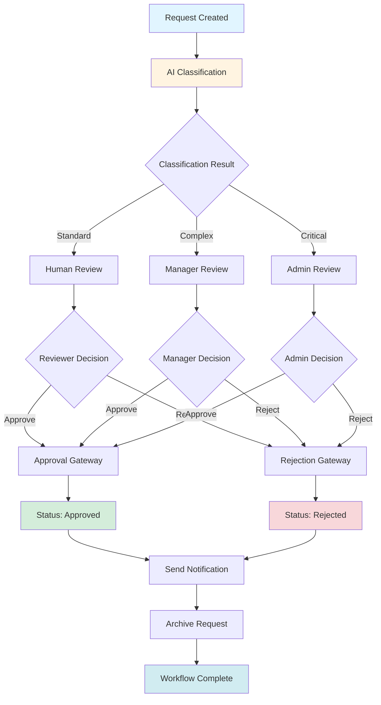

# Service Request Platform - Enterprise Blueprint (Week 3)

## 1. Architecture Diagram

```
┌─────────────────────────────────────────────────────────────────┐
│                         Frontend Layer                          │
│                    (React + Vite)                               │
└────────────────────────────┬────────────────────────────────────┘
                             │ HTTP/REST API
┌────────────────────────────┴────────────────────────────────────┐
│                      API Gateway Layer                          │
│                   (Express.js Server)                           │
├─────────────────────────────────────────────────────────────────┤
│  ┌──────────────┐  ┌──────────────┐  ┌──────────────┐          │
│  │ Auth Service │  │ Request Svc  │  │ Workflow Svc │          │
│  │  Controller  │  │  Controller  │  │  Controller  │          │
│  └──────────────┘  └──────────────┘  └──────────────┘          │
├─────────────────────────────────────────────────────────────────┤
│  ┌──────────────┐  ┌──────────────┐  ┌──────────────┐          │
│  │ RBAC Engine  │  │ ABAC Engine  │  │ Event Bus    │          │
│  │  Middleware  │  │  Middleware  │  │  (Mock)      │          │
│  └──────────────┘  └──────────────┘  └──────────────┘          │
├─────────────────────────────────────────────────────────────────┤
│                    Data Access Layer                            │
│  ┌──────────────┐  ┌──────────────┐  ┌──────────────┐          │
│  │ User Model   │  │ Request Model│  │ Audit Model  │          │
│  └──────────────┘  └──────────────┘  └──────────────┘          │
└────────────────────────────┬────────────────────────────────────┘
                             │
┌────────────────────────────┴────────────────────────────────────┐
│                    Database Layer                               │
│              (SQLite with Foreign Keys)                         │
├─────────────────────────────────────────────────────────────────┤
│ Tables: users, requests, notifications, services,               │
│         service_subscriptions, audit_logs, workflow_states     │
└─────────────────────────────────────────────────────────────────┘

External Integrations:
┌──────────────────┐         ┌──────────────────┐
│  Mock External  │         │  Camunda (Future)│
│      API         │         │  Workflow Engine │
└──────────────────┘         └──────────────────┘
```

## 2. Folder/Code Structure

```
service-request-portal/
├── backend/
│   ├── config/
│   │   └── database.js          # Database configuration & schema
│   ├── controllers/
│   │   ├── authController.js   # Authentication logic
│   │   ├── requestController.js # Request CRUD & workflow
│   │   ├── notificationController.js # Notification management
│   │   ├── serviceController.js # Service catalog management
│   │   ├── workflowController.js # Workflow orchestration
│   │   └── auditController.js  # Audit logging
│   ├── middleware/
│   │   ├── auth.js              # JWT authentication
│   │   ├── rbac.js              # Role-based access control
│   │   ├── abac.js              # Attribute-based access control
│   │   └── validate.js          # Request validation
│   ├── models/
│   │   ├── User.js              # User model with RBAC/ABAC
│   │   ├── Request.js           # Request model with workflow
│   │   ├── Service.js           # Service model
│   │   └── AuditLog.js          # Audit log model
│   ├── routes/
│   │   ├── authRoutes.js        # Authentication endpoints
│   │   ├── requestRoutes.js     # Request management endpoints
│   │   ├── notificationRoutes.js # Notification endpoints
│   │   ├── serviceRoutes.js     # Service catalog endpoints
│   │   ├── workflowRoutes.js    # Workflow endpoints
│   │   └── auditRoutes.js       # Audit log endpoints
│   ├── services/
│   │   ├── aiService.js         # AI classification service
│   │   ├── eventBus.js          # Event/message simulation
│   │   ├── externalApi.js       # Mock external API integration
│   │   └── workflowEngine.js    # Workflow state machine
│   ├── tests/
│   │   └── app.test.js          # Integration tests
│   └── server.js                # Express server entry point
├── src/
│   ├── components/
│   │   ├── auth/                # Authentication components
│   │   ├── dashboard/           # Dashboard components
│   │   ├── services/            # Service catalog components
│   │   ├── workflow/            # Workflow management components
│   │   └── shared/              # Shared UI components
│   ├── pages/
│   │   ├── Dashboard.jsx        # Main dashboard
│   │   ├── ServiceCatalog.jsx   # Service subscription page
│   │   ├── WorkflowMonitor.jsx  # Workflow status monitoring
│   │   └── AuditLog.jsx         # Audit log viewer
│   ├── services/
│   │   ├── api.js               # API client
│   │   ├── authService.js       # Auth service
│   │   ├── serviceService.js    # Service catalog service
│   │   └── workflowService.js   # Workflow service
│   └── context/
│       ├── AuthContext.jsx      # Authentication context
│       └── WorkflowContext.jsx # Workflow state context
└── docs/
    └── week-3/
        └── 01-enterprise-blueprint.md # This document
```

## 3. Database Schema

### Users Table
```sql
CREATE TABLE users (
  id INTEGER PRIMARY KEY AUTOINCREMENT,
  username TEXT UNIQUE NOT NULL,
  password TEXT NOT NULL,
  role TEXT NOT NULL,                    -- applicant, reviewer, manager, admin
  department TEXT,                      -- IT, HR, Finance, etc.
  region TEXT,                          -- North, South, East, West
  email TEXT,
  created_at DATETIME DEFAULT CURRENT_TIMESTAMP,
  updated_at DATETIME DEFAULT CURRENT_TIMESTAMP
);
```

### Services Table
```sql
CREATE TABLE services (
  id INTEGER PRIMARY KEY AUTOINCREMENT,
  name TEXT NOT NULL,
  description TEXT NOT NULL,
  category TEXT NOT NULL,               -- Hardware, Software, Access, etc.
  department TEXT,                      -- Department responsible
  requires_approval BOOLEAN DEFAULT 1,
  active BOOLEAN DEFAULT 1,
  created_at DATETIME DEFAULT CURRENT_TIMESTAMP
);
```

### Service Subscriptions Table
```sql
CREATE TABLE service_subscriptions (
  id INTEGER PRIMARY KEY AUTOINCREMENT,
  user_id INTEGER NOT NULL,
  service_id INTEGER NOT NULL,
  subscribed_at DATETIME DEFAULT CURRENT_TIMESTAMP,
  FOREIGN KEY (user_id) REFERENCES users(id),
  FOREIGN KEY (service_id) REFERENCES services(id),
  UNIQUE(user_id, service_id)
);
```

### Requests Table (Enhanced)
```sql
CREATE TABLE requests (
  id INTEGER PRIMARY KEY AUTOINCREMENT,
  title TEXT NOT NULL,
  description TEXT NOT NULL,
  category TEXT NOT NULL,
  priority TEXT NOT NULL,               -- Low, Medium, High, Critical
  status TEXT DEFAULT 'Submitted',      -- Workflow states
  workflow_status TEXT,                 -- Current workflow step
  user_id INTEGER NOT NULL,
  service_id INTEGER,
  department TEXT,
  region TEXT,
  reviewer_id INTEGER,                  -- Assigned reviewer
  manager_id INTEGER,                   -- Assigned manager
  ai_summary TEXT,
  ai_positive_tests TEXT,
  ai_negative_tests TEXT,
  created_at DATETIME DEFAULT CURRENT_TIMESTAMP,
  updated_at DATETIME DEFAULT CURRENT_TIMESTAMP,
  FOREIGN KEY (user_id) REFERENCES users(id),
  FOREIGN KEY (service_id) REFERENCES services(id),
  FOREIGN KEY (reviewer_id) REFERENCES users(id),
  FOREIGN KEY (manager_id) REFERENCES users(id)
);
```

### Workflow States Table
```sql
CREATE TABLE workflow_states (
  id INTEGER PRIMARY KEY AUTOINCREMENT,
  request_id INTEGER NOT NULL,
  current_state TEXT NOT NULL,          -- Submitted, Reviewing, Approved, Rejected
  previous_state TEXT,
  actor_id INTEGER,                     -- User who caused transition
  actor_role TEXT,
  transition_reason TEXT,
  created_at DATETIME DEFAULT CURRENT_TIMESTAMP,
  FOREIGN KEY (request_id) REFERENCES requests(id),
  FOREIGN KEY (actor_id) REFERENCES users(id)
);
```

### Audit Logs Table
```sql
CREATE TABLE audit_logs (
  id INTEGER PRIMARY KEY AUTOINCREMENT,
  user_id INTEGER,
  action TEXT NOT NULL,                 -- CREATE, UPDATE, DELETE, APPROVE, REJECT
  entity_type TEXT NOT NULL,            -- request, service, user, subscription
  entity_id INTEGER,
  old_values TEXT,                      -- JSON string of previous state
  new_values TEXT,                      -- JSON string of new state
  ip_address TEXT,
  user_agent TEXT,
  timestamp DATETIME DEFAULT CURRENT_TIMESTAMP,
  FOREIGN KEY (user_id) REFERENCES users(id)
);
```

### Notifications Table (Existing)
```sql
CREATE TABLE notifications (
  id INTEGER PRIMARY KEY AUTOINCREMENT,
  request_id INTEGER NOT NULL,
  user_id INTEGER NOT NULL,
  message TEXT NOT NULL,
  status TEXT DEFAULT 'unread',
  created_at DATETIME DEFAULT CURRENT_TIMESTAMP,
  FOREIGN KEY (request_id) REFERENCES requests(id),
  FOREIGN KEY (user_id) REFERENCES users(id)
);
```

## 4. Authentication Flow

```
┌─────────────┐
│   User      │
└──────┬──────┘
       │ 1. POST /api/auth/login
       │    {username, password}
       ▼
┌─────────────────────┐
│  AuthController     │
│  - Validate creds   │
│  - Hash check       │
└──────┬──────────────┘
       │ 2. Valid credentials
       ▼
┌─────────────────────┐
│  JWT Generation     │
│  - user.id          │
│  - user.role        │
│  - user.department  │
│  - user.region      │
└──────┬──────────────┘
       │ 3. Return token
       ▼
┌─────────────┐
│   Client    │
│  Store token│
└──────┬──────┘
       │ 4. Subsequent requests
       │    Authorization: Bearer <token>
       ▼
┌─────────────────────┐
│  Auth Middleware    │
│  - Verify JWT       │
│  - Extract user     │
│  - Attach to req    │
└──────┬──────────────┘
       │ 5. Request proceeds
       ▼
┌─────────────────────┐
│  RBAC/ABAC Check    │
│  - Role validation  │
│  - Attribute check  │
└──────┬──────────────┘
       │ 6. Access granted/denied
       ▼
┌─────────────────────┐
│  Resource Access    │
└─────────────────────┘
```

## 5. RBAC Rules

### Role Hierarchy
```
Admin (Level 4)
  ├── All permissions
  ├── User management
  ├── Service management
  └── Audit log access

Manager (Level 3)
  ├── View all requests in department
  ├── Approve/Reject requests
  ├── Assign reviewers
  └── View department analytics

Reviewer (Level 2)
  ├── View assigned requests
  ├── Add review comments
  ├── Recommend approval/rejection
  └── Update request status

Applicant (Level 1)
  ├── Create requests
  ├── View own requests
  ├── Subscribe to services
  └── View own notifications
```

### Permission Matrix

| Action                | Applicant | Reviewer | Manager | Admin |
|-----------------------|-----------|----------|---------|-------|
| Create Request        | ✅        | ✅       | ✅      | ✅    |
| View Own Requests     | ✅        | ✅       | ✅      | ✅    |
| View All Requests     | ❌        | ❌       | ✅ (dept)| ✅   |
| Update Own Request    | ✅        | ❌       | ❌      | ✅    |
| Delete Own Request    | ✅        | ❌       | ❌      | ✅    |
| Approve Request       | ❌        | ❌       | ✅      | ✅    |
| Reject Request        | ❌        | ❌       | ✅      | ✅    |
| Assign Reviewer       | ❌        | ❌       | ✅      | ✅    |
| Manage Services       | ❌        | ❌       | ❌      | ✅    |
| View Audit Logs        | ❌        | ❌       | ❌      | ✅    |
| Manage Users          | ❌        | ❌       | ❌      | ✅    |

## 6. ABAC Rules

### Department-Based Access
```javascript
// Manager can only view requests from their department
if (user.role === 'manager' && user.department !== request.department) {
  return deny('Department mismatch');
}

// Reviewers only see requests from services in their department
if (user.role === 'reviewer' && user.department !== service.department) {
  return deny('Service department mismatch');
}
```

### Request Owner Access
```javascript
// Users can only modify their own requests
if (action === 'update' && user.id !== request.user_id) {
  return deny('Not request owner');
}

// Users can only view their own notifications
if (resource === 'notification' && user.id !== notification.user_id) {
  return deny('Not notification owner');
}
```

### Priority-Based Rules
```javascript
// High priority requests require manager approval
if (request.priority === 'High' || request.priority === 'Critical') {
  requireApproval('manager');
}

// Critical requests require admin review
if (request.priority === 'Critical') {
  requireApproval('admin');
}
```

### Region/Branch-Based Rules
```javascript
// Regional managers can only approve requests in their region
if (user.role === 'manager' && user.region !== request.region) {
  return deny('Region restriction');
}

// Admins can override region restrictions
if (user.role === 'admin') {
  return allow('Admin override');
}
```

### Combined ABAC Example
```javascript
function canApproveRequest(user, request) {
  // Base role check
  if (!['manager', 'admin'].includes(user.role)) {
    return false;
  }

  // Department check (unless admin)
  if (user.role === 'manager' && user.department !== request.department) {
    return false;
  }

  // Region check (unless admin)
  if (user.role === 'manager' && user.region !== request.region) {
    return false;
  }

  // Priority escalation
  if (request.priority === 'Critical' && user.role !== 'admin') {
    return false;
  }

  return true;
}
```

## 7. Camunda Workflow Diagram



### Workflow States
1. **Submitted** - Initial state after request creation
2. **Classifying** - AI classification in progress
3. **Reviewing** - Human review in progress
4. **Manager Review** - Manager-level review
5. **Admin Review** - Admin-level review for critical requests
6. **Approved** - Final approved state
7. **Rejected** - Final rejected state

### Transitions
- `Submitted → Classifying` (automatic after creation)
- `Classifying → Reviewing/Manager Review/Admin Review` (based on AI classification)
- `Reviewing → Approved/Rejected` (reviewer decision)
- `Manager Review → Approved/Rejected` (manager decision)
- `Admin Review → Approved/Rejected` (admin decision)

## 8. API List

### Authentication Endpoints
- `POST /api/auth/login` - User login
- `POST /api/auth/logout` - User logout
- `GET /api/auth/me` - Get current user info

### Service Catalog Endpoints
- `GET /api/services` - List all available services
- `GET /api/services/:id` - Get service details
- `POST /api/services` - Create new service (admin only)
- `PUT /api/services/:id` - Update service (admin only)
- `DELETE /api/services/:id` - Delete service (admin only)

### Service Subscription Endpoints
- `GET /api/subscriptions` - Get user's subscriptions
- `POST /api/subscriptions/:serviceId` - Subscribe to service
- `DELETE /api/subscriptions/:serviceId` - Unsubscribe from service

### Request Endpoints
- `GET /api/requests` - List requests (filtered by role/permissions)
- `GET /api/requests/:id` - Get request details
- `POST /api/requests` - Create new request
- `PUT /api/requests/:id` - Update request
- `DELETE /api/requests/:id` - Delete request
- `PUT /api/requests/:id/status` - Update request status
- `POST /api/requests/:id/approve` - Approve request
- `POST /api/requests/:id/reject` - Reject request
- `POST /api/requests/:id/assign-reviewer` - Assign reviewer

### Workflow Endpoints
- `GET /api/workflow/:requestId` - Get workflow state
- `POST /api/workflow/:requestId/transition` - Trigger workflow transition
- `GET /api/workflow/:requestId/history` - Get workflow history

### Notification Endpoints
- `GET /api/notifications` - Get user notifications
- `PUT /api/notifications/:id/read` - Mark notification as read
- `GET /api/notifications/unread-count` - Get unread count

### Audit Log Endpoints
- `GET /api/audit` - Get audit logs (admin only)
- `GET /api/audit/:entityType/:entityId` - Get audit history for entity

### External Integration Endpoints
- `POST /api/external/sync` - Sync with external system (mock)
- `GET /api/external/status` - Check external system status (mock)

## 9. Integration Points

### Internal Integrations
1. **AI Service Integration**
   - Endpoint: Internal AI classification service
   - Purpose: Automatic request categorization and priority assignment
   - Protocol: HTTP/REST

2. **Event Bus Integration**
   - Component: Local event simulation
   - Purpose: Decouple components via event-driven architecture
   - Events: request.created, request.approved, request.rejected

3. **Notification Service Integration**
   - Component: In-app notification system
   - Purpose: Real-time user notifications
   - Trigger: Workflow state changes

### External Integrations (Mock)
1. **External ERP System**
   - Mock Endpoint: `/api/external/erp/sync`
   - Purpose: Sync approved requests with ERP
   - Data: Request details, approval metadata

2. **External Ticketing System**
   - Mock Endpoint: `/api/external/ticketing/create`
   - Purpose: Create external tickets for approved requests
   - Data: Request ID, title, assignee

3. **External Analytics Service**
   - Mock Endpoint: `/api/external/analytics/push`
   - Purpose: Push metrics for reporting
   - Data: Request counts, approval rates, processing times

## 10. Message Queue Events

### Event Types
```javascript
// Request Lifecycle Events
{
  eventType: 'request.created',
  requestId: 123,
  userId: 456,
  timestamp: '2024-01-15T10:30:00Z',
  payload: {
    title: 'New Laptop Request',
    category: 'Hardware',
    priority: 'Medium'
  }
}

{
  eventType: 'request.classified',
  requestId: 123,
  classification: {
    category: 'Hardware',
    priority: 'High',
    complexity: 'Standard'
  }
}

{
  eventType: 'request.approved',
  requestId: 123,
  approverId: 789,
  approverRole: 'manager',
  timestamp: '2024-01-15T14:30:00Z'
}

{
  eventType: 'request.rejected',
  requestId: 123,
  rejecterId: 789,
  rejecterRole: 'manager',
  reason: 'Budget constraints',
  timestamp: '2024-01-15T14:30:00Z'
}

// Workflow Events
{
  eventType: 'workflow.transition',
  requestId: 123,
  fromState: 'Reviewing',
  toState: 'Approved',
  actorId: 789,
  timestamp: '2024-01-15T14:30:00Z'
}

// Subscription Events
{
  eventType: 'service.subscribed',
  userId: 456,
  serviceId: 12,
  timestamp: '2024-01-15T10:30:00Z'
}

// Audit Events
{
  eventType: 'audit.log',
  userId: 456,
  action: 'UPDATE',
  entityType: 'request',
  entityId: 123,
  timestamp: '2024-01-15T10:30:00Z'
}
```

### Event Flow
```
┌──────────────┐
│   Action     │
└──────┬───────┘
       │
       ▼
┌──────────────┐
│ Event Bus    │
│ (Publish)    │
└──────┬───────┘
       │
       ├──► Notification Service
       ├──► Audit Logger
       ├──► External Integration
       └───► Analytics Collector
```

## 11. Service Subscription Model

### Service Categories
- **Hardware Services** - Laptops, monitors, peripherals
- **Software Services** - License requests, software installation
- **Access Services** - System access, permissions
- **Infrastructure Services** - Network requests, server access
- **Support Services** - Help desk, technical support

### Subscription Rules
1. Users can only subscribe to active services
2. Subscriptions are per-user, not per-department
3. Users can only create requests for subscribed services
4. Admins can view and manage all subscriptions
5. Services can be department-specific

### Subscription Flow
```
┌─────────────┐
│    User     │
└──────┬──────┘
       │ 1. Browse Service Catalog
       ▼
┌──────────────────┐
│ Service Catalog  │
│ (Filter by dept) │
└──────┬───────────┘
       │ 2. Select Service
       ▼
┌──────────────────┐
│ Subscribe Action │
└──────┬───────────┘
       │ 3. Create Subscription
       ▼
┌──────────────────┐
│ Validate Access  │
│ (Role check)     │
└──────┬───────────┘
       │ 4. Subscription Created
       ▼
┌──────────────────┐
│ Update UI        │
│ (Show subscribed)│
└──────────────────┘
```

## 12. Notification Flow

### Notification Triggers
1. **Request Created** - Notify relevant reviewers/managers
2. **Request Assigned** - Notify assigned reviewer
3. **Request Approved** - Notify request owner
4. **Request Rejected** - Notify request owner with reason
5. **Status Change** - Notify relevant parties
6. **Subscription Added** - Confirm subscription to user
7. **Workflow Transition** - Notify workflow participants

### Notification Channels
- **In-App Notifications** - Real-time UI notifications
- **Notification Center** - Persistent notification list
- **Unread Counter** - Badge showing unread count

### Notification Priority
- **Critical** - Immediate attention required
- **High** - Time-sensitive actions
- **Normal** - Standard notifications
- **Low** - Informational updates

### Notification Flow Diagram
```
┌──────────────┐
│   Event      │
└──────┬───────┘
       │
       ▼
┌──────────────┐
│ Determine    │
│ Recipients   │
└──────┬───────┘
       │
       ▼
┌──────────────┐
│ Create       │
│ Notification │
└──────┬───────┘
       │
       ├──► In-App Store
       ├──► Real-time Push
       └───► Unread Counter
```

## 13. Known Limitations

### Current Prototype Limitations
1. **Single-Node Architecture** - No horizontal scaling
2. **SQLite Database** - Not suitable for high-concurrency production
3. **No Real Message Queue** - Event simulation is in-memory only
4. **No External System Integration** - Mock endpoints only
5. **No Email/SMS Notifications** - In-app notifications only
6. **No OAuth/SSO** - Basic JWT authentication only
7. **No Rate Limiting** - No API rate limiting implemented
8. **No Caching Layer** - No Redis or similar caching
9. **No File Upload** - No attachment support for requests
10. **No Advanced Search** - Basic filtering only

### Security Limitations
1. **No Input Sanitization** - Basic validation only
2. **No CSRF Protection** - No CSRF tokens implemented
3. **No Security Headers** - Missing security HTTP headers
4. **No Audit Trail Review** - Audit logs not reviewed
5. **No Session Management** - JWT only, no session revocation

### Scalability Limitations
1. **No Load Balancing** - Single server instance
2. **No Database Replication** - No read replicas
3. **No CDN Integration** - Static assets served locally
4. **No Background Jobs** - All processing is synchronous

## 14. Future Improvements

### Short-term Improvements
1. **Add Rate Limiting** - Implement API rate limiting
2. **Add CSRF Protection** - Implement CSRF tokens
3. **Add File Upload** - Support request attachments
4. **Add Advanced Search** - Full-text search capabilities
5. **Add Data Export** - CSV/PDF export functionality
6. **Add Email Notifications** - SMTP integration
7. **Add Mobile Support** - Responsive design improvements

### Medium-term Improvements
1. **Upgrade Database** - PostgreSQL or MySQL
2. **Add Redis Caching** - Improve performance
3. **Add Real Message Queue** - RabbitMQ or Kafka
4. **Add Real Camunda** - Actual workflow engine
5. **Add OAuth/SSO** - Enterprise authentication
6. **Add Monitoring** - Application performance monitoring
7. **Add Load Balancing** - Horizontal scaling

### Long-term Improvements
1. **Microservices Architecture** - Split into services
2. **Multi-tenant Support** - SaaS capabilities
3. **Advanced Analytics** - Business intelligence
4. **Machine Learning** - Predictive analytics
5. **API Gateway** - Centralized API management
6. **Service Mesh** - Microservices communication
7. **Disaster Recovery** - Backup and failover systems

## 15. Basic Working Enhanced Prototype

### Implemented Features
- ✅ Enhanced user model with role, department, region
- ✅ Service catalog management
- ✅ Service subscription system
- ✅ RBAC with 4 roles (Applicant, Reviewer, Manager, Admin)
- ✅ ABAC with department, owner, priority, region rules
- ✅ Audit logging system
- ✅ Workflow status model
- ✅ Simple approval/rejection workflow
- ✅ Event/message simulation system
- ✅ Mock external API endpoints
- ✅ Enhanced request creation with service selection
- ✅ Workflow state tracking
- ✅ In-app notifications (existing)
- ✅ Basic authentication (existing)

### Prototype Usage Flow
1. **User Registration/Login** - Enhanced with department/region
2. **Service Subscription** - Browse and subscribe to services
3. **Request Creation** - Select from subscribed services only
4. **AI Classification** - Automatic request classification
5. **Workflow Assignment** - Auto-assign based on rules
6. **Review Process** - Reviewer/Manager/Admin approval
7. **Notification** - Real-time status updates
8. **Audit Trail** - Complete action logging
9. **External Integration** - Mock sync with external systems

### Technical Stack
- **Frontend**: React + Vite + CSS
- **Backend**: Express.js + Node.js
- **Database**: SQLite with foreign keys
- **Authentication**: JWT
- **Authorization**: RBAC + ABAC middleware
- **Events**: In-memory event bus simulation
- **Testing**: Jest + Supertest

### Data Model Enhancements
- Users: Added department, region, email fields
- Services: New service catalog table
- Subscriptions: User-service relationship table
- Requests: Enhanced with workflow fields
- Workflow: New workflow state tracking
- Audit: Comprehensive audit logging

### Security Features
- JWT-based authentication
- Role-based access control
- Attribute-based access control
- Audit logging for compliance
- Input validation
- SQL injection prevention (parameterized queries)

---

**Document Version**: 1.0  
**Last Updated**: Week 3 Implementation  
**Status**: Complete Blueprint Document